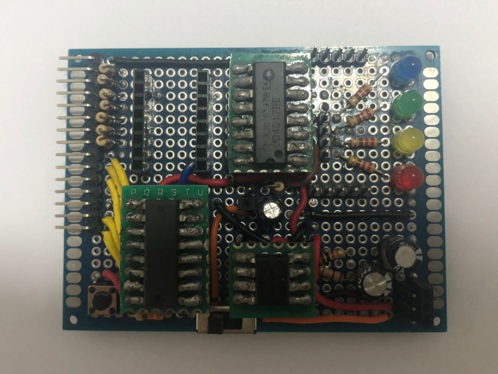
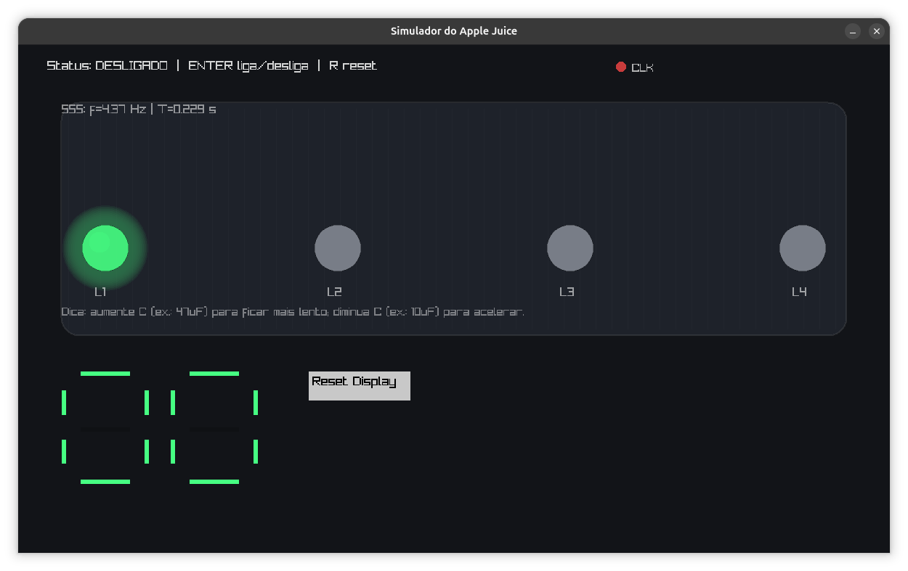

# Apple Juice learning board simulator



O simulador com interface gráfica da placa de aprendizagem Apple Juice foi desenvolvido para o laboratório da FnEsc, no Departamento de Física da UFS. O sistema foi implementado, principalmente, utilizando o paradigma de programação orientada a objetos, com algumas funcionalidades de caráter procedural.

A Apple Juice é uma placa de aprendizagem voltada ao estudo de circuitos digitais construídos com circuitos integrados discretos, como o CD4017, NE555 e CD4026. O sistema oferece suporte à entrada de clock externo, permitindo incrementar a contagem na parte do circuito responsável pela decodificação binária para decimal (a seção que utiliza o CD4026). Além disso, possui um botão de reset para os circuitos CD4017 e um switch para alternar entre o clock externo e o clock interno gerado pelo 555 configurado em modo astável. 

Leia sobre os componentes que estão presentes no projeto clicando [aqui](./docs/appleJuice.pdf).

O objetivo deste projeto foi aplicar os conceitos de programação orientada a objetos apresentados em sala de aula na disciplina de POO, sob orientação do professor Carlos Estombelo. Conceitos como tratamento de exceções com try e catch, encapsulamento, herança e polimorfismo foram utilizados ao longo do desenvolvimento do sistema. 


## Interface gráfica do Apple Juice

<p align="center">
  <a href="https://youtu.be/SVXHdgML4G8">
    
  </a>
</p>

<p align="center">
    Clique na imagem para assistir ao vídeo no YouTube
</p>


## Features 
Simulação do CI NE555 em modo astável
<br>
Simulação do CD4017 (contador Johnson)
<br>
Decodificação com CD4026
<br>
Interface gráfica utilizando raylib
<br>


## Estrutura do projeto
```
Apple-juice-learning-board-simulator/
├── docs/                           # Documentação escrita
│   ├── appleJuice.pdf
│   └── appleJuice.tex
├── images/                         # Imagens do README e do projeto
│   ├── apple-juice-simulator.png
│   └── apple-juice.png
├── materials/                      # Materiais complementares (antes "paraDisciplina")
│   ├── orientacao.pdf
│   └── roteiro.pdf
├── tests/                          # Testes unitários e experimentais
│   ├── test_4026.cpp
│   ├── test_clockGenerator.cpp
│   ├── test_arthur.cpp
│   ├── test_appleJuice.cpp
│   ├── test_renato.cpp
│   └── test_misc.cpp
├── src/                            # Código-fonte
│   └── apple-juice.cpp
├── CONTRIBUTING.md
├── LICENSE
├── Makefile
├── README.md
└── shell.nix
```

## Pré-requisitos
- g++ (com suporte a C++17)
- cmake 
- raylib
- pkg-config

> **NixOS:** use `nix-shell` antes de compilar. O arquivo `shell.nix` já está incluso no repositório.


## Como compilar e rodar

```bash
# clone o repositório
git clone https://github.com/FrankSteps/Apple-juice-learning-board-simulator
cd Apple-juice-learning-board-simulator

# compile o simulador
make

# compile e rode o simulador
make run

# compile e rode os testes unitários
make test

# remova os binários gerados
make clean
```

## Compatibilidade
Este projeto é compatível com Linux, Windows e macOS.

## Licença
Este projeto está licenciado sob a GNU GPLv3. Veja o arquivo [LICENSE](LICENSE) para mais detalhes.

## Colaboradores
| [<br><sub>@franksteps</sub>](https://github.com/franksteps) | [<br><sub>@4rth-gs</sub>](https://github.com/4rth-g) | [<br><sub>@RenatoVPF</sub>](https://github.com/RenatoVPF) | [<br><sub>@Cadu-ux</sub>](https://github.com/Cadu-ux) |
| :---: | :---: | :---: | :---: |
